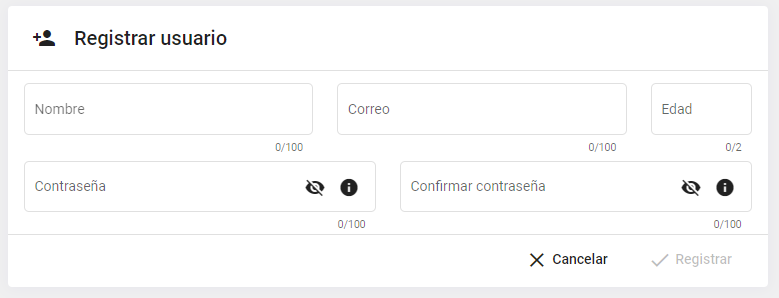
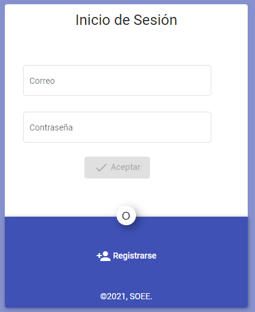
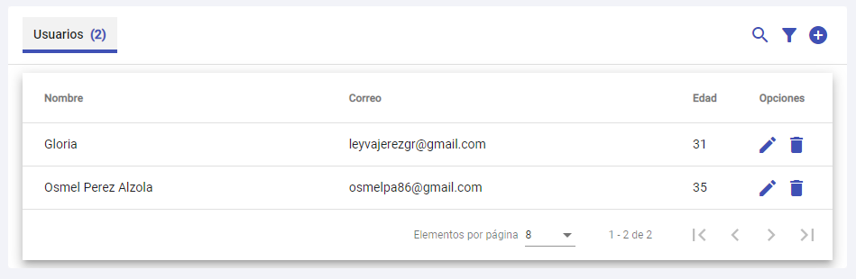
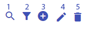
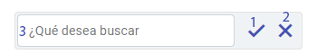
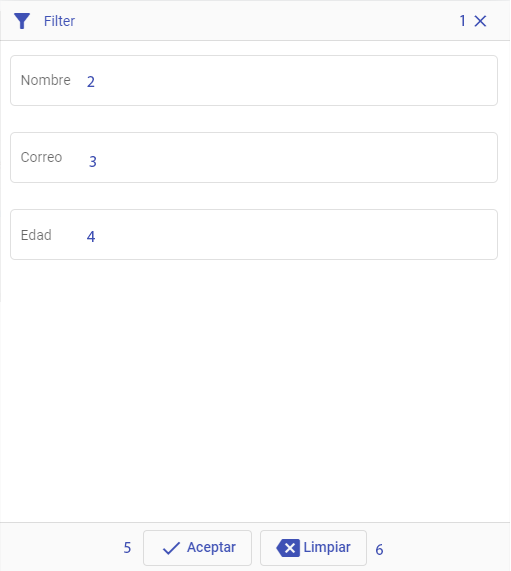
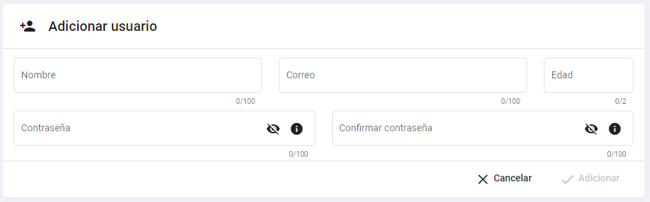
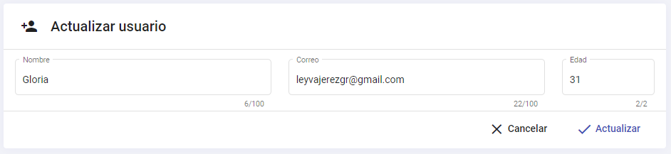
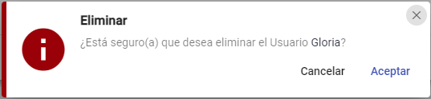
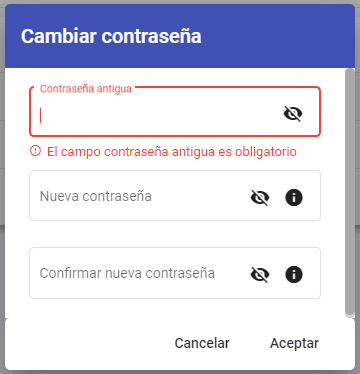

# MANAGE USER APP
App Angular para la gestión de usuarios. El usuario podrá registrarse en el sistema y posteriormente autenticarse, luego podrá acceder al sistema y consultar los datos de los usuarios dados de alta, además de otras acciones como: filtrado, edición, eliminación, cambio de contraseña, entre otras funcionalidades.

## Despliegue
1- Instalar dependencias del proyecto mediante el comando:
    ```
    npm install
    ```
    
2- Correr el proyecto
    ```
    npm run serve
    ```
    
3- Compilar proyecto
    ```
    npm run build
    ```

## Restricciones del ejercicio
1- La app permite dar de alta a los usuarios mediante la opción de registro.    



2- Para acceder a las funcionalidades del sistema deberá autenticarse.
Esta es la típica ventana de email-contraseña en la que el usuario se puede autenticar. Validará las 
credenciales introducidas por el usuario, mostrando los mensajes oportunos de error (las credenciales no 
son correctas, no se ha indicado el campo de email o es incorrecto su formato y no se ha indicado el 
campo de contraseña). Si la validación es correcta, se mostrará la ventana de Listado de Usuarios dados de Alta.



3- El listado de usuarios es una pantalla en la que se listan los usuarios dados de alta para comprobar que
 todo funciona correctamente, es decir que son dados de alta de forma satisfactoria.



Sobre los datos (tabla) podra realizar las siguientes acciones:



    1. Filtrar por cadena de texto.
    2. Filtro por campos específicos.
    3. Adicionar usuario.
    4. Editar usuario.
    5. Eliminar usuario.

4- Filtrar por cadenas de texto
  
   
   
       1. Botón Aceptar: Botón que ejecuta la búsqueda.
       2. Botón que cancela la búsqueda.
       3. Campo donde se introduce el texto por el cual se va a buscar.

5- Filro por campos específicos
   
   
   
       1. Botón cerrar ventana de búsqueda.
       2. Filtrar por nombre.
       3. Filtrar por correo.
       4. Filtrar por edad.
       5. Botón aceptar.
       6. Botón cancelar.

6- Adicionar usuario
Consiste en la creación de nuevos usuarios de la aplicación. Es una pantalla sencilla que sólo incluirá cuatro campos



7- Editar usuario



8- Eliminatr usuario



9- Cambiar contraseña



